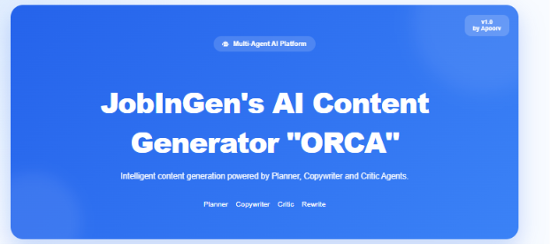
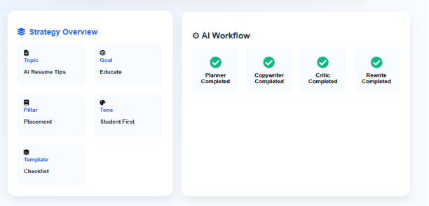
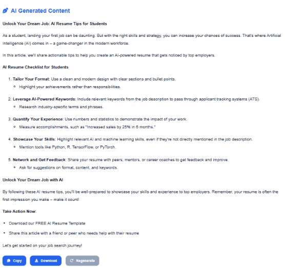

# 🚀 JobInGen's Intelligent Content Engine — ORCA

> **Enterprise Multi-Agent AI Content Intelligence Platform**

<p align="center">

</p>

---

# 📖 Overview

ORCA is an enterprise-grade **Multi-Agent AI Content Intelligence Platform** developed as part of the JobInGen AI Hackathon.

Unlike traditional AI applications that rely on a single prompt, ORCA orchestrates multiple specialized AI agents responsible for planning, writing, reviewing, and refining content before producing the final response.

The platform follows a modular, provider-independent architecture, making it scalable, maintainable, and easy to extend with future AI providers.

---

# 🎯 Problem Statement

Traditional AI content generation systems rely on a single prompt, often producing inconsistent outputs that are difficult to control and improve.

ORCA addresses this challenge by orchestrating specialized AI agents that independently plan, generate, review, and refine content before delivering the final response.

---

# ✨ Features

- 🤖 Multi-Agent AI Architecture
- 🧠 Intelligent Planning Agent
- ✍️ AI Copywriter Agent
- 🔍 AI Critic & Quality Evaluation
- 🔄 Automatic Rewrite Workflow
- 🎭 Persona-driven Prompt Engineering
- 📝 Modular Prompt Builder
- ⚙️ Provider Independent AI Layer
- 🦙 Ollama + Llama 3.2 Integration
- ⚡ FastAPI REST API
- 🌐 Modern React Frontend
- 📋 Copy Generated Content
- 📥 Download Generated Content
- 📄 Markdown Rendering
- 📂 Clean Modular Architecture

---

# 🏗️ System Architecture

```text
                    User
                      │
                      ▼
             React Frontend (Vite)
                      │
                      ▼
              FastAPI REST API
                      │
                      ▼
           Content Workflow Manager
                      │
      ┌──────────┬───────────┬──────────┐
      ▼          ▼           ▼          ▼
  Planner   Copywriter    Critic   Review Parser
      │          │           │          │
      └──────────┴───────────┴──────────┘
                      │
                      ▼
                 AI Service
                      │
                      ▼
             AI Client Factory
                      │
                      ▼
             Ollama / Llama 3.2
                      │
                      ▼
               Final AI Response
```

---

# 🤖 AI Agents

## 🧠 Planner Agent

Responsible for planning the complete content strategy.

Outputs:

- Topic
- Goal
- Tone
- Content Pillar
- Template

---

## ✍️ Copywriter Agent

Generates high-quality content using:

- Persona
- Context
- Instructions

---

## 🔍 Critic Agent

Evaluates generated content based on:

- Brand Voice
- Hook Quality
- Value Density
- Call-to-Action
- Grammar
- Formatting

---

## 🔄 Review Parser

Reads critic feedback and decides whether to:

- Publish
- Rewrite

without exposing that decision logic to the workflow.

---

# ⚙️ Workflow

```text
User Topic

      │

      ▼

 Planner

      │

      ▼

 Strategy

      │

      ▼

 Copywriter

      │

      ▼

 Content

      │

      ▼

 Critic

      │

      ▼

 Review Parser

      │

 Publish or Rewrite
```

---

# 🏛️ Human Analogy

| Software Component | Human Equivalent |
|--------------------|------------------|
| ContentWorkflow | Project Manager |
| PlannerAgent | Strategic Planner |
| Copywriter | Professional Content Writer |
| Critic | Quality Auditor |
| ReviewParser | Decision Officer |
| AIService | Receptionist |
| AIClientFactory | HR Department |
| PersonaLoader | Company Library |
| PromptBuilder | Document Composer |

---

# 📂 Project Structure

```text
jobingen-ai-engine/

├── backend/
│   ├── app/
│   │   ├── agents/
│   │   ├── api/
│   │   ├── clients/
│   │   ├── config/
│   │   ├── core/
│   │   ├── critic/
│   │   ├── persona/
│   │   ├── prompt_builder/
│   │   ├── workflow/
│   │   ├── utils/
│   │   └── tests/
│   ├── prompts/
│   ├── outputs/
│   ├── logs/
│   └── .env

├── frontend/
│   └── src/
│       ├── components/
│       ├── layout/
│       ├── services/
│       ├── styles/
│       ├── App.jsx
│       └── main.jsx

└── README.md
```

---

# ⚙️ Installation

Clone the repository

```bash
git clone https://github.com/ApoorvSrivastava47/jobingen-ai-content-engine.git
```

### Backend

```bash
cd backend

pip install -r requirements.txt

ollama serve

ollama pull llama3.2

uvicorn app.main:app --reload
```

### Frontend

```bash
cd frontend

npm install

npm run dev
```

---

# ▶️ Example Workflow

```text
Topic

↓

Planner

↓

Strategy

↓

Copywriter

↓

Draft

↓

Critic

↓

Review Parser

↓

Publish
or
Rewrite
```

---

# 💻 Tech Stack

## Frontend

- React
- Vite
- React Markdown
- React Icons
- CSS3

## Backend

- FastAPI
- Python
- Pydantic
- Loguru

## AI

- Ollama
- Llama 3.2

## Software Engineering

- Multi-Agent Architecture
- Prompt Engineering
- Object-Oriented Programming
- Workflow Orchestration

---

# 🎯 Why Multi-Agent?

Instead of relying on a single prompt, ORCA separates planning, content generation, quality evaluation, and orchestration into independent AI agents.

Benefits:

- Better maintainability
- Easier debugging
- Reusable agents
- Provider independence
- Cleaner architecture
- Improved content quality

---

# 🚀 Future Scope

- OpenAI Integration
- Google Gemini Integration
- Anthropic Claude Integration
- Docker Deployment
- Authentication & User Accounts
- Content History
- Team Workspace
- Agent Analytics Dashboard
- Multi-language Content Generation
- Real-time Streaming Responses

---

---

# 📸 Screenshots

## 🏠 Home

<p align="center">

</p>

---

## ⚙️ Multi-Agent Workflow

<p align="center">

</p>

---

## ✍️ AI Generated Content

<p align="center">

</p>

---

## 🔍 AI Quality Review

<p align="center">

</p>

# 👨‍💻 Author

## Apoorv Srivastava

**B.Tech Computer Science & Engineering (AI & ML)**

Designed and Developed for the **JobInGen AI Hackathon**

GitHub:
https://github.com/ApoorvSrivastava47

---

# 📜 License

This project is intended for educational, research, and hackathon purposes.

© 2026 Apoorv Srivastava. All rights reserved.

---

# ⭐ Acknowledgements

Developed as part of the **JobInGen AI Hackathon**.

Built using a modular **Multi-Agent AI Architecture** with provider-independent design principles.


